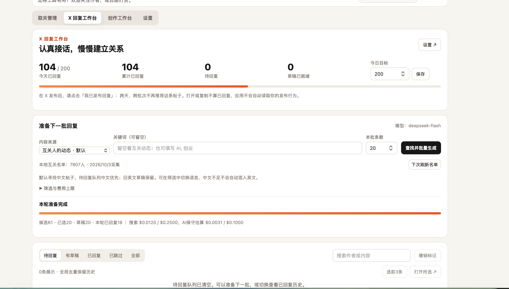
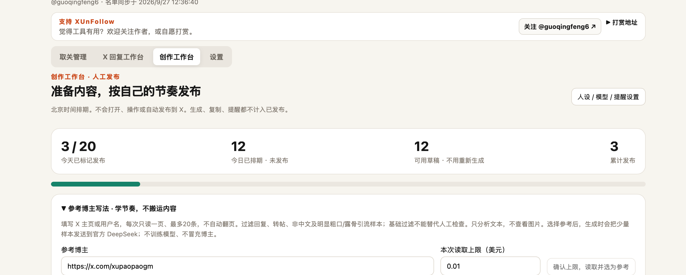
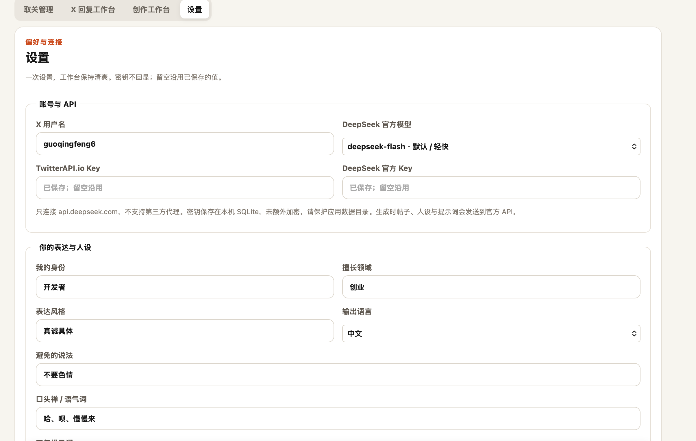

# XUnFollow

> 本地优先的 X 取关管理、回复与创作工作台。用户自带 API Key，名单、草稿和进度保存在自己的电脑上；所有发布由你亲自完成。

[下载最新版桌面安装包](https://github.com/fgq668-lab/XUnFollow/releases/latest) · [关注作者 @guoqingfeng6](https://x.com/guoqingfeng6) · [使用步骤](#使用步骤)

### 支持作者 · 自愿打赏

觉得工具有用，欢迎关注作者或自愿打赏。以下链接用于查看链上地址，不会连接钱包或自动转账；请自行核对链、币种与完整地址。打赏不影响任何功能。

| 链 | 打赏地址（点击查看） |
| --- | --- |
| BSC | [0xD14fd8765c21c2b97539BEE00189f8118AAdbe52](https://bscscan.com/address/0xD14fd8765c21c2b97539BEE00189f8118AAdbe52) |
| SOL | [CmNkNVkobbHAyn3jsaEBaJoAcaNbrTyo7vUwSaSmrVme](https://solscan.io/account/CmNkNVkobbHAyn3jsaEBaJoAcaNbrTyo7vUwSaSmrVme) |
| DOGE | [DQUXapWhCKUbiNX7YJkeTNE1q3zCQAzriV](https://dogechain.info/address/DQUXapWhCKUbiNX7YJkeTNE1q3zCQAzriV) |

## 界面预览

图片直接展示，不需要点击附件或展开。以下为实际使用截图，进度、账号与费用是示例，不代表新用户的初始数据。

### X 回复工作台

设置今日目标，寻找互关动态或关键词帖子，批量生成草稿并记录回复进度。



### 创作工作台

按主题与人设准备内容、参考博主写法、安排北京时间发布计划；不满意时可放弃旧稿重新生成，旧稿仍可恢复。



### 设置 · 密钥、人设与模型

密钥保存在本机 SQLite，不回显、不额外加密；人设、提示词、语气词和官方 DeepSeek 模型统一在这里设置。



## 产品介绍

XUnFollow 帮你找出“你关注、但对方没有关注你”的账号，并把操作变成轻量的人工复核流程：打开外部 X 页面、由你亲自取关、回到应用记录结果、继续下一位。

它不是自动化社交账号操作工具：不读取 X 密码、Cookie 或登录态；不自动关注、取关、点赞、发帖、回复或私信。

「X 回复工作台」默认寻找互关账号的近期动态，也可切换全站关键词搜索。设置今天的回复目标后，批量准备可编辑的草稿；打开单条原帖会自动复制对应草稿，发布后手动标记进度。所有发布仍由用户在 X 上完成。

v0.3.0 重新整理了工作台：账号密钥、人设、提示词、口头禅、模型和费用偏好统一放入「设置」；默认使用 `deepseek-flash`，可选择官方 `deepseek-v4-pro`。默认提示词要求一句约30字的自然口语，以轻轻鼓励为主，不分析、不表态、不感叹、不尬夸，也不虚构经历。口头禅/语气词可自行填写，生成时少量自然使用。结果仍需人工检查，无法保证完全没有 AI 痕迹。

v0.2.2 修复了 macOS 桌面端人设输入框显示有内容、保存时却提示“请填写身份”的问题；API Key 输入框也改为系统密码输入框。

v0.2.3 会自动升级旧版回复数据库，保留已有草稿和取关进度，补齐“重新生成”需要的字段。DeepSeek 返回 401 时会明确提示检查并重新保存官方 Key。

### 取关管理与同步进度


同步在后台进行时，应用会显示进度条、已读取页数、已发现的可处理账号数；名单生成后无需等待全部同步完成，即可开始逐个在 X 中人工处理。

## 为什么是 local-first

- 不需要注册 XUnFollow 账号，也没有云端用户数据库。
- SQLite 名单、处理历史、费用账本与分页检查点只留在本机。
- API Key 仅保存在当前电脑的 XUnFollow SQLite 数据库；不会上传到 XUnFollow 服务器、写入日志、包含在导出文件或提交进源码。数据库中的 Key 未额外加密，请保护电脑和应用数据目录。
- 关系同步与帖子搜索会连接 TwitterAPI.io；生成草稿时选中的帖子内容、人设或文章主题会发送到 DeepSeek 官方 API；打开 X 页面也需要联网。
- API 调用直接从你的电脑发往 Provider；费用由你的 Provider 账户直接结算。

## 当前功能

- TwitterAPI.io BYOK（Bring Your Own Key）接入。
- 同步前先读取公开计数，展示费用预估和用户填写的硬上限。
- Followers IDs 与 Followings 逐页读取，以稳定 X ID 做集合比较。
- 确认费用上限后在后台只读同步：进度条会显示关注者、正在关注列表和可处理账号的实时数量。
- 关注者列表完成后，正在关注列表每同步一页就将已确认的未回关账号写入本地；你可以边处理边等待后续页面。
- 每页先写入本地检查点，成功后才结算本页实际费用。
- 遇到超时、429、5xx、解析失败或计费不确定，立即停止，不会自动重试。
- 未回关名单、搜索、已取关/保留/稍后/关系变化、撤销、本机处理历史、进度 JSON 导入导出。
- 每日默认 10 个；完成后可手动“继续下一批 10 人”。
- 刷新名单时保留以稳定 X ID 保存的既有决定。
- 独立的 X 回复工作台：本地人设、多个关键词、目标数量、语言/时间范围/排序、逐页搜索、推荐理由、批量草稿、编辑/复制/打开 X/手动标记进度、单条重新生成和中断恢复。
- 搜索与 AI 生成分别设置费用上限，显示预估、确认费用与不确定费用；到达上限前停止新的请求。目标数量不保证找到同等数量的合格帖子，也不保证你有权限回复。
- 每日目标、今日/累计回复数、跨批次待回复队列与全局帖子 ID 去重；打开或复制不计入已回复。
- 默认搜索中文，已有队列按中文优先展示，旧英文草稿保留；可切换不限或英文。中文候选不足不会自动混入英文。
- 发布后须手动点「我已发布回复」。已回复帖子跨天、跨批次排除，不重复生成或进入待回复队列；历史中禁用直接打开回复和复制按钮，只有明确恢复待回复才允许再次处理。应用不读取 X 登录态，无法自动识别你在外部页面已经发布的回复。
- 默认搜索互关动态，关键词可留空；以稳定 X ID 验证互关并缓存名单，可手动刷新。缓存显示采集日期，不能代表实时关系。
- 单条打开自动复制；批量最多打开 5 个页面，不覆盖剪贴板。可跳过、撤销状态、查看回复历史。
- 创作工作台：按人设批量准备1–50篇短帖，可选中文热点；待审核/待发布/已发布队列，今日目标与进度，北京时间均匀排期，本机发布通知、15分钟稍后提醒和日历导出。旧文章草稿保留。
- 默认折叠的截图二次创作：主动粘贴/拖入截图，官方 DeepSeek Flash 图片理解后生成新草稿，可补充想法与原帖链接，不自动访问 X。

## 非目标

- 自动取关或任何代替用户操作 X 账号的动作。
- 上传、出售或分析用户名单。
- 读取 X 的登录密码、Cookies、session token 或浏览器资料。
- 将任何真实 API Key、个人名单、SQLite 数据库提交进仓库。

## 使用步骤

1. 从项目的 [Releases](https://github.com/fgq668-lab/XUnFollow/releases) 下载与你系统匹配的桌面包；如果尚未发布安装包，可按下方“本地构建”运行。
2. 在 [TwitterAPI.io](https://twitterapi.io/) 注册，并在自己的 Provider 账户中充值。
3. 打开「设置」，保存自己的 TwitterAPI.io API Key、X 用户名与人设。回复功能还需要 DeepSeek 官方 Key；密钥留空可沿用已有值。
4. 进入「取关管理」，在同步设置中填写本次费用硬上限，点击“保存并估算费用”，确认预估后点击“确认上限，开始只读同步”。
5. 观察顶部同步进度。第一批未回关账号出现后，打开外部 X 页面，由你亲自决定是否取关，再回到 XUnFollow 点“已取关，下一位”或选择其他状态。
6. 每天完成默认 10 个后，点击“继续下一批”；进度会保存在本机，关闭再打开也不会丢失。

### X 回复工作台使用步骤

1. 在「设置」保存身份、领域、风格、输出语言、避免的说法以及回复提示词。提示词可修改或恢复默认。
2. 保存自己的 TwitterAPI.io Key 与 [DeepSeek 官方 API Key](https://platform.deepseek.com/)。密钥留空沿用，保存在本机 SQLite，不回显。选择官方模型和默认费用上限。
3. 设置并保存今日目标，例如 200；它与每批准备条数是两个不同的数字。默认来源是互关动态，关键词可以留空；切换全站搜索时需要 1–8 个关键词。
4. 填写本批条数（1–200），必要时展开筛选与费用上限。点击「查找并批量生成」。首次互关搜索会读取关注者和正在关注名单，计入本轮搜索上限；之后复用缓存。候选和草稿逐步出现，左侧选帖、右侧编辑，可边准备边处理已有草稿。
5. 点击「打开 X 并复制草稿」，到 X 粘贴、检查并亲自发布，再回工作台点击「我已发布回复，下一条」。可批量打开 1–5 个页面；多开不会复制错配的草稿，需逐条复制。打开/复制不计入已回复；跳过和误标记可撤销。
6. 暂停或网络中断后可手动继续；上次请求若可能已计费，界面会提示确认。单条生成失败可点击「重新生成」；上限耗尽可手动提高本轮上限后继续。应用不会自动向 X 发帖。
7. 关闭应用后，目标、帖子 ID 去重、历史与已保存草稿保留在本机；新批次不会重新推荐已回复帖子，未处理草稿继续留在队列。创作请切换到独立「创作工作台」，旧文章也保留。

搜索最多 30 页，每页 Provider 文档写明至多 20 条；费用按当前公开价格作保守预留。实际返回和计费由 Provider 决定，建议从小额度开始。避免机械地大批量发送相似回复；使用前请核对 X 的规则。

### 同步中断怎么办？

正常情况下，后台同步会持续更新页面，直到名单完成。如果在 Provider 请求中关闭了应用或网络中断，下一次打开时会保留已同步的名单和进度。由于最后一个请求的计费结果可能不确定，应用会要求你手动确认一次“继续”，而不会擅自重试或超出费用上限。

## 下载与系统选择

每次推送形如 `v0.2.2` 的版本标签时，GitHub Actions 会自动创建一个 [Release](https://github.com/fgq668-lab/XUnFollow/releases)，并附上以下安装包：

| 你的电脑 | 下载哪个文件 |
| --- | --- |
| Mac，M1/M2/M3/M4 芯片 | 文件名含 `aarch64` 的 `.dmg` |
| Mac，Intel 芯片 | 文件名含 `x64` 的 `.dmg` |
| Windows 10/11，64 位 | `.exe`（NSIS 安装程序） |

当前开源版本使用 ad-hoc 构建，尚未配置 Apple Developer ID 公证或 Windows 商业代码签名。因此系统可能在首次打开时显示“无法验证开发者”或“Windows 已保护你的电脑”。请只从本仓库的 Release 下载，并核对发布版本；正式面向广泛用户分发前，建议配置两端的代码签名。

## 本地构建与开发

前置条件：Node.js 20+、pnpm 10+、Rust stable、以及 macOS 的 Xcode Command Line Tools 或 Windows 的 Microsoft C++ Build Tools/WebView2。Tauri 的具体前置条件见其官方文档。

```bash
pnpm install
pnpm tauri dev
```

只开发前端时可运行：

```bash
pnpm dev
```

验证与打包：

```bash
pnpm install --frozen-lockfile
pnpm check
cargo fmt --manifest-path src-tauri/Cargo.toml -- --check
cargo test --manifest-path src-tauri/Cargo.toml
pnpm tauri build
```

### Windows 本地编译

推荐直接在 Windows 10/11 x64 上构建，不建议从 macOS 交叉编译 Windows 安装程序。先安装 Node.js 22+、pnpm 10+、Rust stable（`x86_64-pc-windows-msvc`），以及 Visual Studio 2022 Build Tools 中的“Desktop development with C++”与 Windows SDK；确保系统有 Microsoft Edge WebView2 Runtime。

在 PowerShell 中执行：

```powershell
git clone https://github.com/fgq668-lab/XUnFollow.git
cd XUnFollow
pnpm install --frozen-lockfile
pnpm check
cargo test --manifest-path src-tauri/Cargo.toml
pnpm tauri build --bundles nsis
```

生成的安装程序在 `src-tauri\\target\\release\\bundle\\nsis\\` 目录。GitHub Actions 也会在每个版本标签上自动执行同一类 Windows 构建。

浏览器开发模式使用完全脱敏的演示数据，绝不会发出 Provider 请求。只有 Tauri 桌面进程才会访问本地数据库和 Provider。

Provider 的价格、限制和条款会变化。XUnFollow 按当前公开价格显示本地估计；每页按返回的项目数、每次生成按返回的 token 用量记账，并在下一次请求前检查上限。此上限是应用侧保护，不是 Provider 账户的官方消费限额。

默认 Rust 测试使用脱敏模拟 Provider 数据，覆盖集合计算、分页费用、检查点、费用不确定路径和本地进度导入；默认不会访问真实 X 账号或 Provider。另有五项需手动启用的真实接口冒烟测试，使用临时数据库并可能产生少量费用，不在 CI 中运行。

## 安全模型

完整说明在 [docs/SECURITY.md](docs/SECURITY.md)，隐私说明在 [docs/PRIVACY.md](docs/PRIVACY.md)。简而言之：

- Rust 核心固定只请求 `https://api.twitterapi.io` 与 `https://api.deepseek.com`。
- 外部链接只允许 `https://x.com/...` 或 `https://www.x.com/...`。
- 费用使用整数微美元记账，不用浮点数。
- 不确定请求按保守预留计入账本，要求用户明确批准后才能重试。
- 项目测试使用脱敏 fixture；请勿向 issue 粘贴 API Key、Cookie、完整名单或 Provider 原始响应。

## 发布

GitHub Actions 在 macOS 与 Windows 上执行类型检查、Rust 测试和桌面构建。公开发行前请配置平台签名：macOS 需要 Developer ID 签名与公证，Windows 推荐代码签名。不要把签名私钥放进仓库或 CI 日志。

## 支持与关注

如果这个本地小工具帮你节省了整理关注列表的时间，欢迎在 X 上关注：

- [@guoqingfeng6](https://x.com/guoqingfeng6)

### 自愿打赏

请自行核对链、币种和完整地址。XUnFollow 不连接钱包、不发起交易；打赏不影响任何功能。

| 链 | 地址 |
| --- | --- |
| BSC | `0xD14fd8765c21c2b97539BEE00189f8118AAdbe52` |
| SOL | `CmNkNVkobbHAyn3jsaEBaJoAcaNbrTyo7vUwSaSmrVme` |
| DOGE | `DQUXapWhCKUbiNX7YJkeTNE1q3zCQAzriV` |

## 创作工作台（v0.4.3）

主流程是「今天计划几条 → 一键生成并排期 → 复制后自己发布 → 回来标记已发布」。生成与复制不计入发布进度。不建议为了数量密集发布。

1. 到「设置」保存官方 DeepSeek Key、人设与创作提示词，选择模型；原有回复提示词独立保留。
2. 上方常驻「今天计划发布几条」和生成按钮。首次设50条、没有库存时，一次点选生成50篇；已有10篇可用草稿且今天已发布2篇时，只补齐38篇，不重复备稿。目标最多200，每次最多50篇。主题自动填入人设领域，可自行修改；真实素材和内容类型可展开设置。开发记录必须有你提供的真实素材。
3. 可勾选热点素材：填写关键词，使用 TwitterAPI.io 的 Top 搜索，优先中文、最近72小时、最低点赞数筛选，最多6页。热门不等于事实可靠，请核实。
4. 确认页面搜索与 AI 上限，点击「生成N篇内容并排期」，同时保存今日目标。内部每5篇分段生成并保存、安排可用草稿，**无需每5篇再点按钮**；可以先复制已有内容。暂停、失败、重启后都保留成果；不确定计费必须由你确认后继续，不自动重试。
5. 按整批数量预留排期；目标50且时段充足时，50篇都排在当天，不会因内部5篇一段被分到多天。生成完成后按北京时间（UTC+8）、新目标重排全部未发布草稿，已发布不变；至少间隔5分钟，今天排不下的明确显示顺延日期。默认时段09:00–22:00，不跨午夜。修改目标后，也可以点击上方显眼的「保存新目标并重新排期（不生成）」并确认，免费复用已有内容；也可单篇改时间。
6. 审核正文与真实来源，审核通过才进入提醒队列。复制正文时可附真实来源链接；配图仅是建议，不自动下载，也不意味着拥有原图授权。发布仍完全由你手动完成，然后点击“我已发布”更新今天/累计进度；已发布内容不会出现在待处理列表。
7. 在设置中开启/测试本机通知。**关闭窗口隐藏到托盘，托盘菜单“退出”、关机、应用未运行时不会提醒。** 多个逾期任务合并通知；系统勿扰/权限可能影响显示。可导出带闹钟的 `.ics` 文件，导入系统日历后由日历提醒；请勿重复导入。

热点仅使用真实 API 返回的来源 ID/链接，去重草稿与已发布来源，不编造来源。生成内容可能出错，不能替代核实。当前创作第一版是短帖库存与发布计划，长文/线程编辑留待后续。

本地可离线查看/编辑草稿、记录进度、安排提醒；搜索与生成需要网络及用户自己的 API 余额。无自动登录、自动发布、自动回复或操作 X 页面。

### 更自然的短帖、多主题与粘贴排版

- 多选「暴论、创业、搞笑、互关、擦边、开发、AI、工具、日常」，也能自定义话题。不同帖轮换不同话题和角度，不把所有主题塞进一条。内置27条选题灵感可免费查看、加入补充要求；灵感不是发生过的事实。擦边只做成年人之间的非露骨暧昧玩笑；暴论针对现象，不人身攻击或造谣。
- 默认提示词改成“一条只讲一个小细节、说完就停”，按话题变化长短和句式，减少总结、鸡汤、喊口号和反问。生成还参考本批已有草稿的开头、结尾，减少跨段重复。旧的默认提示词自动升级，自定义提示词保留；已有草稿不会自动重写。
- 到「设置 → 我平时怎么说话」贴3–5条自己写过的帖子，可更好参考用词与节奏；请别放密钥或隐私。样稿会发送到官方 DeepSeek，仅作生成参考，不训练模型、不照抄样稿事件。
- 旧草稿不用重新批量生成：点「改得更口语」，确认本次 AI 费用上限后，按最新人设、提示词和样稿单独改写。成功才替换，失败保留原文；来源、排期、库存数量和发布进度不变。旧版本留在本机，可免费「恢复改稿前版本」；改写/恢复后需要重新审核。已发布和已跳过内容不参与改稿。
- 卡片的「粘贴预览」就是剪贴板里的正文：保留空行分段，去除 Markdown 标记，不复制内部标题，来源单独附在末尾。使用纯文本排版，不承诺 HTML 字体或加粗在 X 内保留；本应用不操作 X 页面，粘贴由用户自行完成。
- 有总结腔的词会显示「措辞提醒」，不打AI检测分数、不阻止复制。自然程度依赖人设、真实样稿、话题和模型，不能保证“完全没有AI味”；发布前建议删掉一句不属于自己语气的话。

### 放弃旧稿，整批重新生成

不满意当前内容时，先选好主题、补充要求、真实素材和写法参考，再点击「放弃全部未发布草稿，重新生成」，检查确认区里的数量、主题、博主与费用上限，最后确认。目标20条、今天已发布1条时，会重新准备19篇，不必提高目标。

旧稿不是删除，而是保留到「已跳过」，可逐条恢复；已发布内容和进度不变。配置校验失败或队列在确认后发生变化，不会放弃旧稿。确认启动后旧稿退出待发布队列；新请求失败时旧稿仍可恢复，新成果、检查点和费用记录也保留。恢复旧稿会重新计入可用库存；请检查是否与新稿重复。每轮最多50篇，目标更高时再点补齐。

### 参考博主写法（可选）

在创作工作台的「参考博主写法」填写 X 主页链接或用户名，确认单次读取上限后，仅使用 [TwitterAPI.io 公开帖子接口](https://docs.twitterapi.io/api-reference/endpoint/get_user_last_tweets)读取最近一页（最多20条）；不操作 X 页面、不自动翻页、不分析图片。

程序保留中文原创文本，跳过回复、转帖、明显粗口/露骨引流样本，显示采集时间、过滤数量、长度中位数和换行统计。过滤是基础关键词筛选，不是完整安全审核；互动量和小样本不证明账号“成功”、内容真实性或涨粉效果。依赖配图的文案可能缺少语境。

缓存和可编辑参考规则保存在本机，可离线查看。勾选最多2位博主后，生成会向官方 DeepSeek 发送各自最多6条、每条最多800字的文本参考和规则；只借鉴用词、节奏与选题切入，不搬运原句、身份、个人经历或观点，不把参考帖子当成新帖事实来源。优先自己的语气样稿。系统会拒绝与参考原文高度相似的草稿，但不能替代人工原创性检查。

后续生成沿用缓存，不重新支付博主读取费用；只有主动重新读取才请求 API。按当前 [Provider 公开价格](https://twitterapi.io/pricing)，单页保守预留$0.003，按全部返回条数估计结算（过滤掉的条目也计入）。超时或解析失败会标为计费不确定，不自动重试；重试需再次明确确认。该费用与热点搜索、AI生成分别记录。

### 截图二次创作（默认折叠）

展开创作工作台中的「截图二次创作」，点击粘贴区后按 macOS `⌘V` / Windows `Ctrl+V`，或拖入/选择截图。支持 PNG、JPEG、WebP，自动转换为最大边1600像素、2MB以内的 JPEG，上传前可预览和移除。不会自动读取剪贴板、抓取屏幕或访问 X。

可填写补充想法与真实原帖链接（可留空），选择1–3篇，确认 AI 上限后生成。固定使用支持图片的官方 `deepseek-flash`，不改变其他工作台的模型设置；沿用你的人设和创作提示词。生成的二创进入同一个审核、排期、提醒与发布进度流程。不要把别人的截图经历改写成自己的经历，核实图片中的文字/数字，也请尊重原作与图片使用权。

截图只有点击生成后才发送给 DeepSeek 官方；本机暂存支持失败后手动继续，完成或结束本轮后清理缓存记录，不包含在日历或进度导出中。请先遮挡密钥、私信等隐私信息。详见 [DeepSeek 官方图片输入说明](https://api-docs.deepseek.com/guides/vision/)。

## 许可证与商标

本项目采用 Apache-2.0。X、Twitter、TwitterAPI.io 是各自权利人的商标；XUnFollow 与它们没有隶属或背书关系。

## 贡献

欢迎提交 issue 和 PR。请先阅读 [CONTRIBUTING.md](CONTRIBUTING.md)，尤其是安全和真实数据处理要求。
