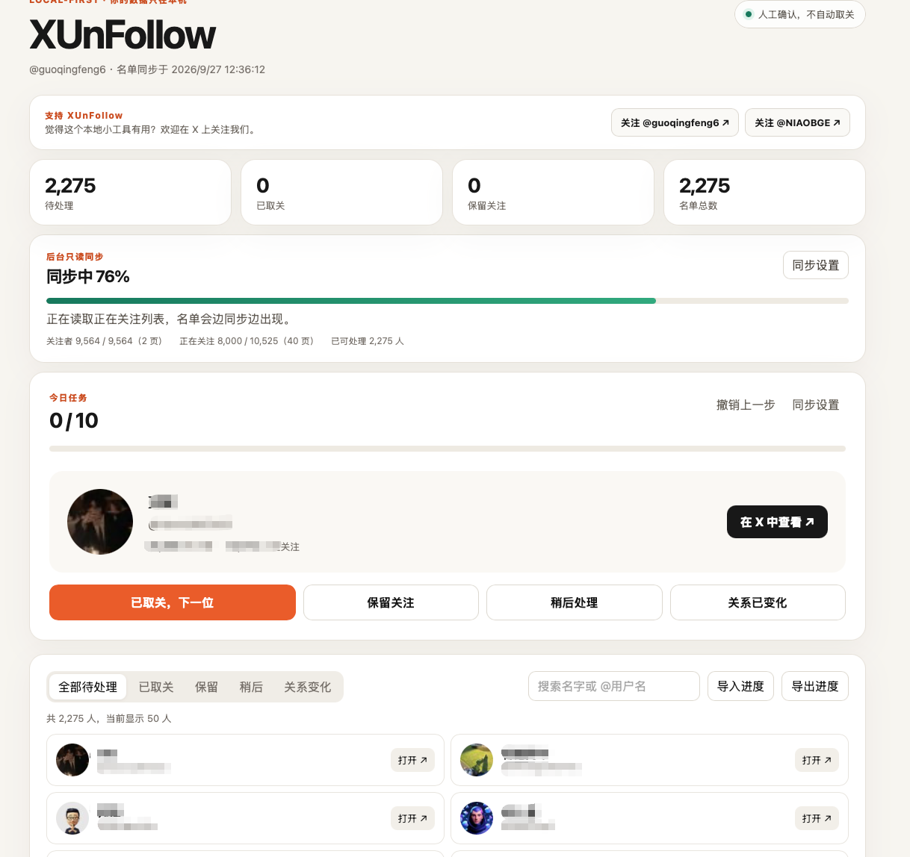

# XUnFollow

> 本地优先的 X 关系清理与回复草稿助手。用户自带第三方 API Key，名单、草稿和进度只保存在自己的电脑上。

XUnFollow 帮你找出“你关注、但对方没有关注你”的账号，并把操作变成轻量的人工复核流程：打开外部 X 页面、由你亲自取关、回到应用记录结果、继续下一位。

它不是自动化社交账号操作工具：不读取 X 密码、Cookie 或登录态；不自动关注、取关、点赞、发帖、回复或私信。

新增的「X 回复工作台」可按关键词、时间、语言和目标数量寻找近期帖子，按相关度、时效与互动量推荐，并使用用户自己的 DeepSeek 官方 API Key 批量生成可编辑回复草稿。所有发布仍由用户在 X 上手动完成。

v0.2.2 修复了 macOS 桌面端人设输入框显示有内容、保存时却提示“请填写身份”的问题；API Key 输入框也改为系统密码输入框。

## 界面预览



同步在后台进行时，应用会显示进度条、已读取页数、已发现的可处理账号数；名单生成后无需等待全部同步完成，即可开始逐个在 X 中人工处理。

## 为什么是 local-first

- 不需要注册 XUnFollow 账号，也没有云端用户数据库。
- SQLite 名单、处理历史、费用账本与分页检查点只留在本机。
- API Key 仅保存在当前电脑的 XUnFollow SQLite 数据库；不会上传到 XUnFollow 服务器、写入日志、包含在导出文件或提交进源码。数据库中的 Key 未额外加密，请保护电脑和应用数据目录。
- 关系同步与帖子搜索会连接 TwitterAPI.io；生成草稿时选中的帖子内容、人设或文章主题会发送到 DeepSeek 官方 API；打开 X 页面也需要联网。
- API 调用直接从你的电脑发往 Provider；费用由你的 Provider 账户直接结算。

## 当前功能

- TwitterAPI.io BYOK（Bring Your Own Key）接入。
- 同步前先读取公开计数，展示费用预估和用户填写的硬上限。
- Followers IDs 与 Followings 逐页读取，以稳定 X ID 做集合比较。
- 确认费用上限后在后台只读同步：进度条会显示关注者、正在关注列表和可处理账号的实时数量。
- 关注者列表完成后，正在关注列表每同步一页就将已确认的未回关账号写入本地；你可以边处理边等待后续页面。
- 每页先写入本地检查点，成功后才结算本页实际费用。
- 遇到超时、429、5xx、解析失败或计费不确定，立即停止，不会自动重试。
- 未回关名单、搜索、已取关/保留/稍后/关系变化、撤销、本机处理历史、进度 JSON 导入导出。
- 每日默认 10 个；完成后可手动“继续下一批 10 人”。
- 刷新名单时保留以稳定 X ID 保存的既有决定。
- 独立的 X 回复工作台：本地人设、多个关键词、目标数量、语言/时间范围/排序、逐页搜索、推荐理由、批量草稿、编辑/复制/打开 X/手动标记进度、单条重新生成和中断恢复。
- 搜索与 AI 生成分别设置费用上限，显示预估、确认费用与不确定费用；到达上限前停止新的请求。目标数量不保证找到同等数量的合格帖子，也不保证你有权限回复。
- 用相同人设生成 X 文章草稿，支持编辑、保存和复制，不自动发布。

## 非目标

- 自动取关或任何代替用户操作 X 账号的动作。
- 上传、出售或分析用户名单。
- 读取 X 的登录密码、Cookies、session token 或浏览器资料。
- 将任何真实 API Key、个人名单、SQLite 数据库提交进仓库。

## 使用步骤

1. 从项目的 [Releases](https://github.com/fgq668-lab/XUnFollow/releases) 下载与你系统匹配的桌面包；如果尚未发布安装包，可按下方“本地构建”运行。
2. 在 [TwitterAPI.io](https://twitterapi.io/) 注册，并在自己的 Provider 账户中充值。
3. 打开 XUnFollow，填入自己的 TwitterAPI.io API Key、X 用户名和本次费用硬上限。
4. 点击“保存并估算费用”，确认预估无误后点击“确认上限，开始只读同步”。
5. 观察顶部同步进度。第一批未回关账号出现后，打开外部 X 页面，由你亲自决定是否取关，再回到 XUnFollow 点“已取关，下一位”或选择其他状态。
6. 每天完成默认 10 个后，点击“继续下一批”；进度会保存在本机，关闭再打开也不会丢失。

### X 回复工作台使用步骤

1. 点击顶部「X 回复工作台」，填入身份、擅长领域、风格、语言与不希望出现的说法，并保存人设。
2. 填入自己的 TwitterAPI.io Key 与 [DeepSeek 官方 API Key](https://platform.deepseek.com/)。已有 TwitterAPI.io Key 可留空沿用；Key 只保存在本机 SQLite。
3. 设置 X 用户名、1–8 个关键词、目标数量（1–200）、语言、时间范围、排序，以及搜索/AI 各自的美元上限。
4. 点击「搜索并批量生成」。合格候选会逐页出现；搜索完成后按推荐排序选出不超过目标数量的帖子，草稿会逐条出现。可随时检查、编辑、复制、打开原帖，并在自己发布后标记「已回复」；不合适的帖子可「跳过」。
5. 暂停或网络中断后可手动继续；上次请求若可能已计费，界面会提示确认。单条生成失败可点击「重新生成」；如 AI 上限耗尽，可手动提高本轮上限后继续。应用不会自动向 X 发帖。
6. 文章草稿只需填写主题，生成后可修改、保存、复制。生成会调用 DeepSeek 官方 API，按你的 DeepSeek 账户计费。

搜索最多 30 页，每页 Provider 文档写明至多 20 条；费用按当前公开价格作保守预留。实际返回和计费由 Provider 决定，建议从小额度开始。避免机械地大批量发送相似回复；使用前请核对 X 的规则。

### 同步中断怎么办？

正常情况下，后台同步会持续更新页面，直到名单完成。如果在 Provider 请求中关闭了应用或网络中断，下一次打开时会保留已同步的名单和进度。由于最后一个请求的计费结果可能不确定，应用会要求你手动确认一次“继续”，而不会擅自重试或超出费用上限。

## 下载与系统选择

每次推送形如 `v0.2.2` 的版本标签时，GitHub Actions 会自动创建一个 [Release](https://github.com/fgq668-lab/XUnFollow/releases)，并附上以下安装包：

| 你的电脑 | 下载哪个文件 |
| --- | --- |
| Mac，M1/M2/M3/M4 芯片 | 文件名含 `aarch64-apple-darwin` 的 `.dmg` |
| Mac，Intel 芯片 | 文件名含 `x86_64-apple-darwin` 的 `.dmg` |
| Windows 10/11，64 位 | `.exe`（NSIS 安装程序） |

当前开源版本使用 ad-hoc 构建，尚未配置 Apple Developer ID 公证或 Windows 商业代码签名。因此系统可能在首次打开时显示“无法验证开发者”或“Windows 已保护你的电脑”。请只从本仓库的 Release 下载，并核对发布版本；正式面向广泛用户分发前，建议配置两端的代码签名。

## 本地构建与开发

前置条件：Node.js 20+、pnpm 10+、Rust stable、以及 macOS 的 Xcode Command Line Tools 或 Windows 的 Microsoft C++ Build Tools/WebView2。Tauri 的具体前置条件见其官方文档。

```bash
pnpm install
pnpm tauri dev
```

只开发前端时可运行：

```bash
pnpm dev
```

验证与打包：

```bash
pnpm install --frozen-lockfile
pnpm check
cargo fmt --manifest-path src-tauri/Cargo.toml -- --check
cargo test --manifest-path src-tauri/Cargo.toml
pnpm tauri build
```

### Windows 本地编译

推荐直接在 Windows 10/11 x64 上构建，不建议从 macOS 交叉编译 Windows 安装程序。先安装 Node.js 22+、pnpm 10+、Rust stable（`x86_64-pc-windows-msvc`），以及 Visual Studio 2022 Build Tools 中的“Desktop development with C++”与 Windows SDK；确保系统有 Microsoft Edge WebView2 Runtime。

在 PowerShell 中执行：

```powershell
git clone https://github.com/fgq668-lab/XUnFollow.git
cd XUnFollow
pnpm install --frozen-lockfile
pnpm check
cargo test --manifest-path src-tauri/Cargo.toml
pnpm tauri build --bundles nsis
```

生成的安装程序在 `src-tauri\\target\\release\\bundle\\nsis\\` 目录。GitHub Actions 也会在每个版本标签上自动执行同一类 Windows 构建。

浏览器开发模式使用完全脱敏的演示数据，绝不会发出 Provider 请求。只有 Tauri 桌面进程才会访问本地数据库和 Provider。

Provider 的价格、限制和条款会变化。XUnFollow 按当前公开价格显示本地估计；每页按返回的项目数、每次生成按返回的 token 用量记账，并在下一次请求前检查上限。此上限是应用侧保护，不是 Provider 账户的官方消费限额。

默认 Rust 测试使用脱敏模拟 Provider 数据，覆盖集合计算、分页费用、检查点、费用不确定路径和本地进度导入；默认不会访问真实 X 账号或 Provider。另有两项需手动启用的真实接口冒烟测试，使用临时数据库并可能产生少量费用，不在 CI 中运行。

## 安全模型

完整说明在 [docs/SECURITY.md](docs/SECURITY.md)，隐私说明在 [docs/PRIVACY.md](docs/PRIVACY.md)。简而言之：

- Rust 核心固定只请求 `https://api.twitterapi.io` 与 `https://api.deepseek.com`。
- 外部链接只允许 `https://x.com/...` 或 `https://www.x.com/...`。
- 费用使用整数微美元记账，不用浮点数。
- 不确定请求按保守预留计入账本，要求用户明确批准后才能重试。
- 项目测试使用脱敏 fixture；请勿向 issue 粘贴 API Key、Cookie、完整名单或 Provider 原始响应。

## 发布

GitHub Actions 在 macOS 与 Windows 上执行类型检查、Rust 测试和桌面构建。公开发行前请配置平台签名：macOS 需要 Developer ID 签名与公证，Windows 推荐代码签名。不要把签名私钥放进仓库或 CI 日志。

## 支持与关注

如果这个本地小工具帮你节省了整理关注列表的时间，欢迎在 X 上关注：

- [@guoqingfeng6](https://x.com/guoqingfeng6)
- [@NIAOBGE](https://x.com/NIAOBGE)

## 许可证与商标

本项目采用 Apache-2.0。X、Twitter、TwitterAPI.io 是各自权利人的商标；XUnFollow 与它们没有隶属或背书关系。

## 贡献

欢迎提交 issue 和 PR。请先阅读 [CONTRIBUTING.md](CONTRIBUTING.md)，尤其是安全和真实数据处理要求。
